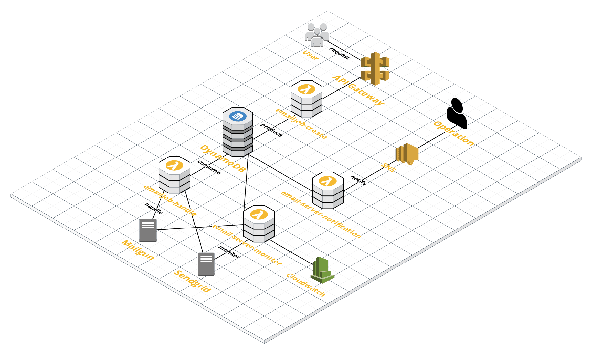

# serverless-emails

This is email service based on serverless environment

## Architecture


### Description
Basically the system is composed of following lambda functions, which allow it to handle email requests asynchronously
- emailJob-create: <br/> receive request from api-gateway and create a new job in emailJobTable
- emailJob-handle: <br/> triggered by emailJobTable's kinesis event and send emailJob requests to integrated emailServers 
- emailServer-monitor: <br/> triggered by cloudwatch's cron and check emailSever health status
- emailServer-notification: <br/> triggered by emailServerTable's kinesis event and send sns when all servers are down

## Local Development

### Installation
````
npm install
````

### Running
````
npm run start
````

Use `serverless-offline` to start server in local

### Unit Testing
````
npm run unit-test
````

Use `mocha`, `chai` and `sinon` to do unit tests

### Integration Testing
````
npm run pre-integration-test
npm run integration-test
````

Launch server based on `serverless-offline` and `amazon/dynamodb-local` dockerised in `docker-compose`

## Deployment - dev
Currently the repo is deployable to dev.
````
SLS_DEBUG=* serverless deploy
````

## Call in dev environment
```
curl --request POST \
  --url https://s456kea6x2.execute-api.ap-southeast-2.amazonaws.com/dev/email \
  --header 'Content-Type: application/json' \
  --data '{"from": "${from}",  "to": "${to}",  "subject": "subject",  "content": "content"}'
```

### Code Structure
- `/src` - source code
- `/src/config` - environment configuration
- `/src/const` - constants
- `/src/lambda` - lambda functions
- `/src/service` - services
- `/src/utils` - utilities
- `/tests/unit` - unit tests
- `/tests/integration` - integration tests

### Code Standard
- node.js 8
- eslint with Airbnb 

## TODO
- emailServer-monitor and emailServer-notification needs integration tests